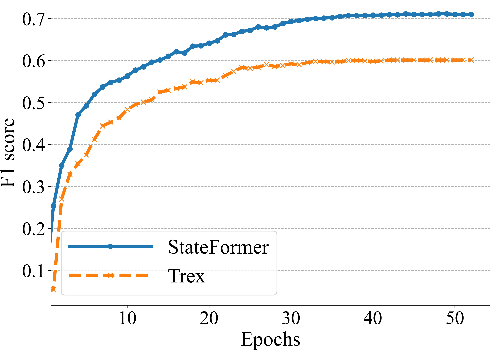

# StateFormer: Fine-Grained Type Recovery from Binaries Using Generative State Modeling

## Introduction

This repository includes [StateFormer](https://drive.google.com/drive/folders/1KpUMIWewzVZ7KkhIo3dKg8X9nfCUvvHV?usp=sharing)'s source code (see following for setup), [Datasets](https://drive.google.com/drive/folders/1KpUMIWewzVZ7KkhIo3dKg8X9nfCUvvHV?usp=sharing), and the supplementary material such as [Appendix](https://drive.google.com/file/d/1vguDZs6ytWm2uL-yxmmCYW6Asl09Mfry/view?usp=sharing).

StateFormer is a machine learning based tool that aims to recover types from binary executable. It extends Fairseq toolkit. 

## Installation
We recommend `conda` to setup the environment and install the required packages.

First, create the conda environment,

`conda create -n StateFormer python=3.8 numpy scipy scikit-learn`

and activate the conda environment:

`conda activate StateFormer`

Then, install the latest Pytorch (assume you have GPU):

`conda install pytorch torchvision cudatoolkit=10.2 -c pytorch`

Finally, enter the StateFormer root directory: e.g., `path/to/StateFormer`, and install StateFormer:

`pip install --editable .`

## Preparation

### Pretrained models:

Create the `checkpoints` and `checkpoints/pretrain` subdirectory in `path/to/StateFormer`

`mkdir checkpoints`, `mkdir checkpoints/pretrain`

Download our [pretrained weight parameters](https://drive.google.com/file/d/1npWNDJM0lEtslpUNI19b2m_2wNcRTAy-/view?usp=sharing) and put in `checkpoints/pretrain`

### Sample data for finetuning type inference

We provide the sample training/testing files of finetuning in `data-src/finetune`
If you want to prepare the finetuning data yourself, make sure you follow the format shown in `data-src/finetune`.

We have to binarize the data to make it ready to be trained. To binarize the training data for finetuning, run:

`python command/finetune/preprocess.py`

The binarized training data ready for finetuning (for function boundary) will be stored at `data-bin/finetune`

## Training

To finetune the model, run:

`./command/finetune/finetune.sh`

The scripts loads the pretrained weight parameters from `checkpoints/pretrain/` and finetunes the model.

## Results Update During Rebuttal

We run both pretrained TREX and StateFormer on our x64-O3 dataset. The results are like following. Specifically, after 50 epochs, StateFormer obtains 71 F1 score while TREX obtains 60.1 F1 score.

