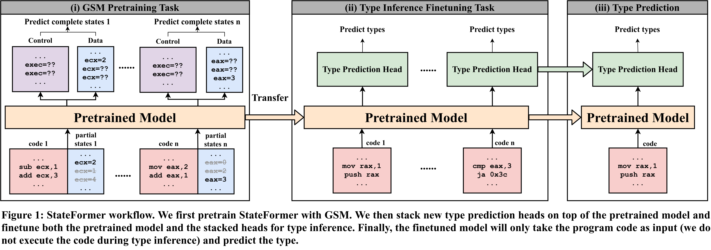
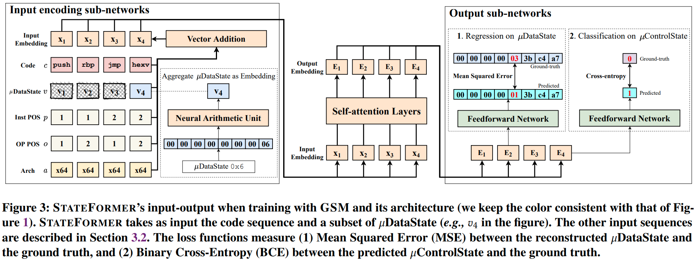

# StateFormer: Fine-Grained Type Recovery from Binaries Using Generative State Modeling

## Introduction

[StateFormer](https://sites.google.com/site/kexinpeisite/stateformer.pdf?attredirects=0) is a tool that aims to recover source-level type information from stripped binary executable based on transfer learning. Inspired by how human analyzer reason about the program, we propose a pretraining task called Generative State Modeling (GSM) to teach an ML model assembly code operational semantics, and then transfer the learned knowledge for type inference. See our [paper](https://sites.google.com/site/kexinpeisite/stateformer.pdf?attredirects=0) for details.

<p align="center"></p>

We develop a hierarchical input combination module to learn across multiple modalities of the program, i.e., code, execution trace, structures (positional embeddings) with self-attention layers in Transformer. We further employ [Neural Arithmetic Units (NAU)](https://arxiv.org/abs/2001.05016) to help the model learn how instructions manipulate numerical values. To implement StateFormer, we extend [Fairseq](https://github.com/pytorch/fairseq) toolkit. 

<p align="center"></p>


This repository includes StateFormer source code (see following for setup), [Raw Datasets](https://drive.google.com/drive/folders/1FXlrGiZkch9bnAxlrm43IhYGC3r5NveA?usp=sharing), [Preprocessed Pretraining Datasets](https://drive.google.com/drive/folders/1Q410EtaQsMkH6id1oUavbAcAOsoc_1Mk?usp=sharing) and the [Supplementary Material](https://drive.google.com/file/d/1zdmYlZL0AQgaK7Nxg26UAoQ8toHtQlSC/view?usp=sharing).

## Installation
We recommend `conda` to setup the environment and install the required packages. Conda installation instructions can be found [here](https://docs.conda.io/projects/conda/en/latest/user-guide/install/linux.html). The following setup assumes Conda is installed and is running on Linux system (though Windows should work too).

First, create the conda environment,

`conda create -n stateformer python=3.8 numpy scipy scikit-learn`

and activate the conda environment:

`conda activate stateformer`

Then, install the latest Pytorch (assume you have GPU and CUDA installed -- check CUDA version by `nvcc -V`. More [info](https://pytorch.org/get-started/locally/)):

`conda install pytorch torchvision torchaudio cudatoolkit=11.1 -c pytorch -c nvidia`

Finally, clone the StateFormer and enter its directory: e.g., `path/to/StateFormer`, and install StateFormer:

```bash
git clone https://github.com/CUMLSec/stateformer.git
cd stateformer
pip install --editable .
```

### Optional:

For efficient processing of large datasets, please install PyArrow: 

`pip install pyarrow`

For faster training install NVIDIA's apex library:

``` bash
git clone https://github.com/NVIDIA/apex
cd apex
pip install -v --no-cache-dir --global-option="--cpp_ext" --global-option="--cuda_ext" \
  --global-option="--deprecated_fused_adam" --global-option="--xentropy" \
  --global-option="--fast_multihead_attn" ./
```

## Preparation

### Pretrained Model:

Create the `checkpoints` and `checkpoints/pretrain` subdirectory in `path/to/StateFormer`

`mkdir -p checkpoints/pretrain`

Download our [pretrained weight parameters](https://drive.google.com/file/d/1JWwJa6YwKppzGKqJe4rfZFKDXQ5YJqg_/view?usp=sharing) and put in `checkpoints/pretrain`

### Training and Testing Samples for Finetuning

We provide all training and testing (named as valid.*) samples of finetuning used in our paper at [here](https://drive.google.com/drive/folders/1rUKQtfa4EHRc_GI6HTaqJSiP2mMBJ1Pt?usp=drive_link). You can download and put them in `data-src/finetune`.
If you want to prepare the finetuning data yourself, make sure you follow the format shown in `data-src/finetune`.

The training/testing samples we provided (that you put in `data-src`) is in plaintext, which facilitates understanding and generating dataset by yourself. 

However, the plaintext data can not be directly fed to the model for training -- we have to binarize the data. To binarize the training data for finetuning, run:

`python command/finetune/preprocess.py`

This script will iterate through all directories in `data-src`, binarize each of them, and store the binarized dataset at `data-bin/finetune`

### Sample Finetuning Set
In case you do not want to binarize all dataset (and do not want to download all the dataset), we have already provided a sample training/testing set in `data-src/finetune/mips-O0`, which is sampled from MIPS O0 binaries. 

To binarize the sample training data for finetuning, run:

`python command/finetune/preprocess_mips_O0.py`

Likewise, the binarized data will be stored at `data-bin/finetune/mips-O0`

## Training and Testing

Before starting training, create a directory that the logged training result can be stored:

`mkdir result`

To finetune the model on our provided samples (MIPS O0), run:

`./command/finetune/finetune_mips_O0.sh`

The script will load the pretrained weight parameters from `checkpoints/pretrain/` and finetunes the model. If you encounter memory overflow, try to increase `--update-freq` and decrease `$MAX_SENTENCES` in the script. This will reduce the batch size but aggregate the gradient for more batches, resulting in the same effective batch size.

It should be easy to edit `./command/finetune/finetune_mips_O0.sh` to finetune on other binarized data.

### Optional

In case you are interested in pretraining, we have also provided our pretraining (for GSM) dataset at [here](https://drive.google.com/drive/folders/1Q410EtaQsMkH6id1oUavbAcAOsoc_1Mk?usp=sharing). Similar to the finetuning dataset, you can download it and put it under `data-src/pretrain`.

Similarly, to binarize the pretraining data, run:

`python command/pretrain/preprocess_pretrain`

To run pretraining (not recommended as it is time-consuming):

`./command/pretrain/pretrain.sh`

### Testing
As described above, we name testing set as `valid`, such that our training script will automatically evaluate on the testing set after every epoch (similar to validation). Both the training and testing metrics are logged and printed during training.

For example, when running finetuning for MIPS O0, as described above, you will observe the testing precision/recall/F1 close to the corresponding numbers in the Table 2 of the paper.
